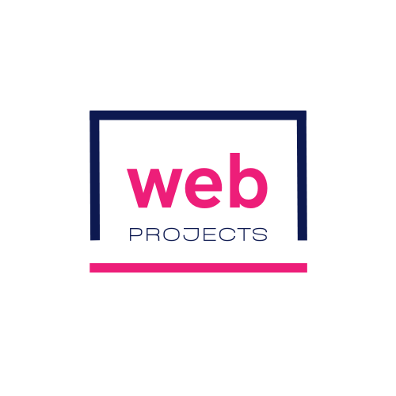
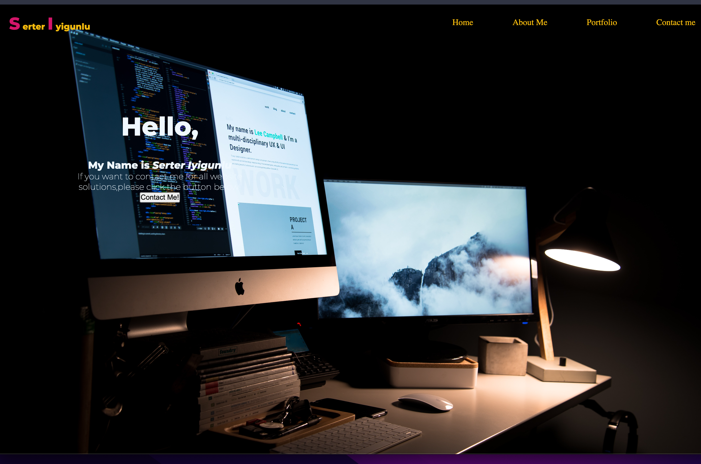
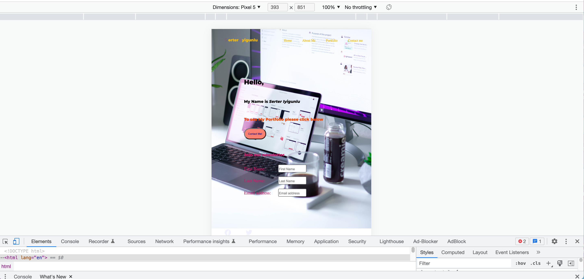
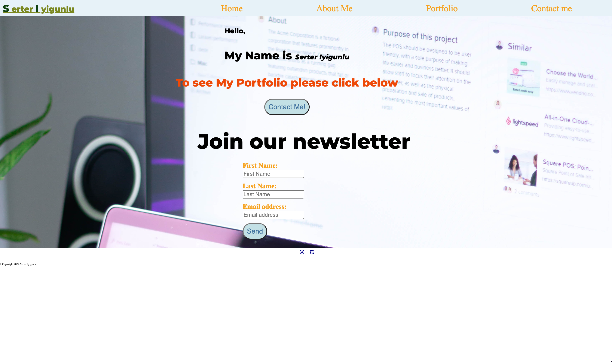
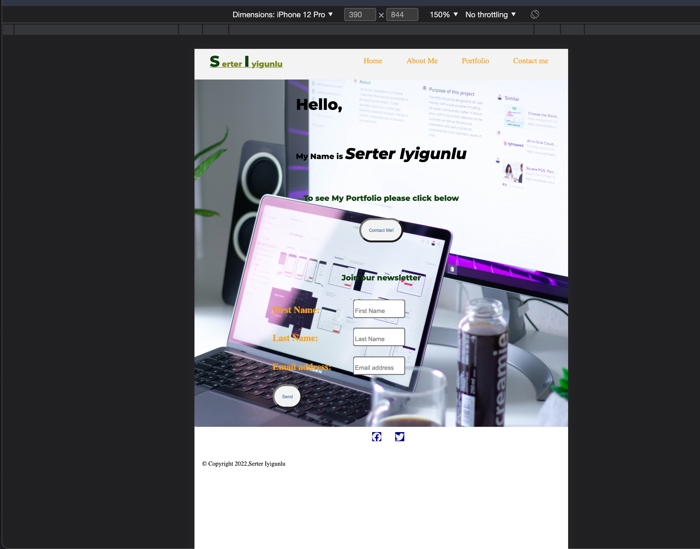

# Portfolio Web site

### This is a web site about Serter Iyigunlu who is a professional web designer. You can reach me throuh the web site and see my jobs.

## Portfolio web site about Serter Iyigunlu

### Font-color choosing

#### I choosed colored coolers font color because I wanted my site give an expression to cool view to the viewer. Mainly orange,red orangew,forest green and lime green colors used.

## Html tags

<br>

### Nav bar section for home page

```html
<section class="nav-bar">
  <nav>
    <div class="logo">
      <a href="./">
        
      </a>
    </div>
    <div class="nav-lists">
      <ul class="nav-list">
        <li>
          <a href="./">Home</a>
        </li>
        <li>
          <a href="aboutMe.html" target="_blank"> About Me</a>
        </li>
        <li>
          <a href="myExperience.html" target="_blank">Portfolio</a>
        </li>
        <li>
          <a href="contactMe.html" target="_blank">Contact me</a>
        </li>
      </ul>
    </div>
  </nav>
</section>
```

<br>

### Main section for home page

```html
<!--Main Section-->
<main class="main-content">
  <div class="contactMe">
    <h3 id="salute">
      <span id="firstSalute">Hello,</span>
      <br />
      My Name is
      <i id="name">Serter Iyigunlu</i>
    </h3>
    <p id="info">To see My Portfolio please click below</p>
    <button
      class="btn"
      type="button"
      onclick="location.href ='./myExperience.html'"
    >
      Contact Me!
    </button>
  </div>
  <div class="signUp">
    <h2 class="join-list">Join our newsletter</h2>
    <form id="form-signUp">
      <div class="form-elements">
        <label for="first-name" class="select"> First Name: </label>
        <input
          type="text"
          name="fist-name"
          id="first-name"
          placeholder="First Name"
          class="select-input"
        />
      </div>
      <div class="form-elements">
        <label for="last-name" class="select"> Last Name: </label>
        <input
          type="text"
          name="last-name"
          id="last-name"
          placeholder="Last Name"
          class="select-input"
        />
      </div>
      <div class="form-elements">
        <label for="email" class="select"> Email address: </label>
        <input
          type="email"
          name="email"
          id="email"
          placeholder="Email address"
          class="select-input"
        />
      </div>
      <div class="form-elements">
        <button class="btn" type="submit" name="submit">Send</button>
      </div>
    </form>
  </div>
</main>
```

<br>

## Footer section of the web site

```html
<footer>
  <div class="iconShow">
    <a
      href="https://www.linkedin.com/in/serter-iyigunlu-18897955/"
      class="icon-link"
    >
      <i class="fa-brands fa-linkedin  icons"></i>
    </a>
    <a href="https://twitter.com/home" class="icon-link">
      <i class="fa-brands fa-twitter icons"></i>
    </a>
    <a href="https://github.com/serteri" class="icon-link">
      <i class="fa-brands fa-github  icons"></i>
    </a>
  </div>
  <span class="copyRight">&copy Copyright 2022,Serter Iyigunlu</span>
</footer>
```

## Sass styling for home page mobile approach

### button scss

```css
@mixin button {
  padding: 0.5rem;
  border-radius: 85px;
  background-color: $color-backgroung;
  color: $color-btn;
  font-size: 0.6rem;

  &:hover {
    color: $color-general;
    transform: scale(1.3);
  }
}

@mixin button-about {
  padding: 0.5rem;
  border-radius: 85px;
  background-color: $color-ahover;
  color: $color-btn;
  font-size: 0.3rem;
}
```

### color scss

```css
$color-general: #e55b13;
$color-links: #f6a21e;
$color-ahover: #e55b13;
$color-btn: #41729f;
$color-backgroung: #e7f2f8;
$color-nav-logo-letter: #7a871e;
```

### default scss

```css
* {
  box-sizing: border-box;
  padding: 0;
  margin: 0;
}

$nav: 1rem;
$width_general: 100%;

$padding-general: 1.5rem;
```

### flex box scss

```css
@mixin flex-box-center {
  display: flex;
  justify-content: center;
  align-items: center;
}
@mixin flex-box-center-column {
  display: flex;
  flex-direction: column;
  justify-content: center;
  align-items: center;
}
```

### fonst scss

```css
$fontsize-general: 0.5rem;
$font-size-firstletters: 1rem;
$font-size-middle: 1.2rem;
$fontsize-big: 1.3rem;
$font-size-bigger: 2rem;
$font-size-p: 0.9em;
$fontfamily-general: "Montserrat", sans-serif;
```

## Navigation Design

```css
.nav-bar {
  width: 100%;
  background-color: #e7f2f8;
  height: 2.5rem;
}
.nav-bar nav {
  display: flex;
  justify-content: center;
  align-items: center;
  flex: 1 1 0;
}
.nav-bar nav img {
  width: 48px;
  margin: 0 1em;
}
.nav-bar nav .nav-lists {
  width: 60%;
}
.nav-bar nav .nav-lists li {
  font-size: 0.5rem;
}
.nav-bar nav .nav-list {
  list-style-type: none;
  display: flex;
  justify-content: flex-end;
}
.nav-bar nav .nav-list li {
  padding-left: 1.2rem;
}
.nav-bar nav .nav-list li a {
  text-decoration: none;
  color: #f6a21e;
}
.nav-bar nav .nav-list li a:hover {
  color: #e55b13;
}
```

## Main Section sass design

```css
.main-content {
  display: flex;
  justify-content: center;
  align-items: center;
  flex: 1 1 0;
  margin-top: 0.3rem;
  width: 100%;
}
.main-content .contactMe {
  display: flex;
  flex-direction: column;
  justify-content: center;
  align-items: center;
  flex: 1 1 0;
  background-color: #fbe7c6;
  border-radius: 15%;
  padding-top: 2rem;
  margin-left: 0.5rem;
  margin-right: 0.5rem;
  height: 300px;
}
.main-content .contactMe #salute {
  font-size: 0.5rem;
  color: black;
  text-align: center;
  font-family: "Montserrat", sans-serif;
}
.main-content .contactMe #salute #firstSalute {
  font-size: 1rem;
  display: inline-block;
  padding-bottom: 2rem;
}
.main-content .contactMe #salute #name {
  font-size: 1rem;
}
.main-content .contactMe #info {
  color: #e55b13;
  font-family: "Montserrat", sans-serif;
  margin-top: 2rem;
  font-weight: 600;
  margin-bottom: 1rem;
  font-size: 0.5rem;
}
.main-content .contactMe .btn {
  padding: 0.5rem;
  border-radius: 85px;
  background-color: #e1c340;
  color: #e55b13;
  font-size: 0.5rem;
}
.main-content .contactMe .btn:hover {
  color: #e55b13;
  transform: scale(1.3);
}
.main-content .signUp {
  display: flex;
  flex-direction: column;
  justify-content: center;
  align-items: center;
  flex: 1 1 0;
  height: 300px;
  background-color: #f8ea8c;
  border-radius: 15%;
  margin-right: 0.5rem;
}
.main-content .signUp .join-list {
  margin-top: 0.6rem;
  color: #e55b13;
  font-weight: bolder;
  font-family: "Montserrat", sans-serif;
  font-size: 0.5rem;
  padding-bottom: 0.5rem;
}
.main-content .signUp #form-signUp .form-elements {
  margin-top: 0.6rem;
  width: 80%;
}
.main-content .signUp #form-signUp .form-elements .select {
  width: 80px;
  display: inline-block;
  color: #f6a21e;
  font-size: 0.6rem;
  font-weight: bolder;
}
.main-content .signUp #form-signUp .form-elements .select-input {
  width: 35%;
}
.main-content .signUp #form-signUp .form-elements .select-input::placeholder {
  font-size: 0.4rem;
}
.main-content .signUp #form-signUp .form-elements .btn {
  padding: 0.5rem;
  border-radius: 85px;
  background-color: #e1c340;
  color: #e55b13;
  font-size: 0.5rem;
}
.main-content .signUp #form-signUp .form-elements .btn:hover {
  color: #e55b13;
  transform: scale(1.3);
}
```

## Blog section css

```css
.blog {
  margin-top: 1.2rem;
  width: 100%;
  background-color: #e7f2f8;
}
.blog h1 {
  display: block;
  text-align: center;
  margin-bottom: 2rem;
  padding-top: 0.8rem;
}
.blog .blogs .blog-examples {
  list-style-type: none;
}
.blog .blogs .blog-examples li {
  display: block;
  width: 80%;
  margin-top: 1.5rem;
  margin-left: 2rem;
}
.blog .blogs .blog-examples li a {
  display: inline-block;
  text-decoration: none;
  color: black;
  padding-top: 0.5rem;
  padding-bottom: 0.6rem;
}
.blog .blogs .blog-examples li a img {
  width: 100%;
  padding-top: 1.2rem;
  display: block;
}
.blog .blogs .blog-examples:last-child {
  margin-bottom: 2rem;
}
```

## Footer section css

```css
footer {
  background-color: #e7f2f8;
  display: flex;
  flex-direction: column;
  justify-content: center;
  align-items: center;
  width: 100%;
  height: 100%;
}

.iconShow {
  display: flex;
  justify-content: center;
  align-items: center;
  flex: 1 1 0;
  height: 20px;
  width: 100vw;
}
.iconShow .icon-link {
  padding-top: 1.2rem;
  text-decoration: none;
  color: currentColor;
}
.iconShow .icon-link:hover {
  transform: scale(1.2);
}

.icon-contact {
  margin-top: 9rem;
}

.icons {
  margin-left: 0.9rem;
  width: 18px;
}

.copyRight {
  display: block;
  margin-left: 0.5rem;
  font-size: 0.6rem;
  margin-top: 0.9rem;
}
```

## Css for other devies

```css
// * Media Queries */

@media screen and (min-width: 600px) and (max-width: 759px) {
  .nav-bar {
    display: flex;
    justify-content: center;
    align-items: center;
    flex: 1 1 0;
  }
  .nav-bar nav {
    width: 100%;
    background-color: #e7f2f8;
    height: 2.3rem;
  }
  .nav-bar nav .logo a img {
    width: 64px;
    margin: 0 1em;
  }
  .nav-bar nav .nav-lists {
    width: 80%;
  }
  .nav-bar nav .nav-lists li a {
    text-decoration: none;
    font-size: 1rem;
    margin-left: 0.7rem;
  }
  .main-content {
    display: flex;
    justify-content: center;
    align-items: center;
    flex: 1 1 0;
    width: 100%;
    height: 80%;
  }
  .main-content .contactMe {
    margin-right: 5rem;
    display: flex;
    justify-content: center;
    align-items: center;
    flex: 1 1 0;
  }
  .main-content .contactMe #salute {
    color: black;
    font-family: "Montserrat", sans-serif;
    font-size: 1rem;
  }
  .main-content .contactMe #salute #firstSalute {
    font-size: 2rem;
    display: inline-block;
    padding-bottom: 2rem;
  }
  .main-content .contactMe #salute #name {
    font-size: 1rem;
  }
  .main-content .contactMe #info {
    color: rgb(238, 73, 8);
    font-family: "Montserrat", sans-serif;
    margin-top: 2rem;
    font-weight: 600;
    margin-bottom: 1.4rem;
    font-size: 0.9em;
  }
  .main-content .contactMe .btn {
    padding: 0.5rem;
    border-radius: 85px;
    background-color: #e1c340;
    color: #e55b13;
    font-size: 0.7rem;
  }
  .main-content .contactMe .btn:hover {
    color: #e55b13;
    transform: scale(1.3);
  }
  .main-content .signUp {
    display: flex;
    flex-direction: column;
    justify-content: center;
    align-items: center;
    flex: 1 1 0;
    margin-bottom: 1.2rem;
  }
  .main-content .signUp .join-list {
    margin-top: 2rem;
    color: #e55b13;
    font-weight: bolder;
    font-family: "Montserrat", sans-serif;
    font-size: 1.2rem;
    padding-bottom: 0.5rem;
  }
  .main-content .signUp #form-signUp .form-elements {
    margin-top: 0.6rem;
    width: 100%;
  }
  .main-content .signUp #form-signUp .form-elements .select {
    width: 42%;
    display: inline-block;
    font-size: 1rem;
  }
  .main-content .signUp #form-signUp .form-elements .select-input {
    width: 40%;
  }
  .main-content .signUp #form-signUp .form-elements input::placeholder {
    font-size: 0.8rem;
  }
  .main-content .signUp #form-signUp .form-elements .btn {
    padding: 0.5rem;
    border-radius: 85px;
    background-color: #e1c340;
    color: #e55b13;
    font-size: 0.7rem;
  }
  .main-content .signUp #form-signUp .form-elements .btn:hover {
    color: #e55b13;
    transform: scale(1.3);
  }
  .form-contact {
    background-image: url(./images/contact.jpg);
    background-size: cover;
    width: 100%;
    height: 100%;
  }
  .btn {
    padding: 0.5rem;
    border-radius: 85px;
    background-color: #c3e0e5;
    color: #e55b13;
    font-size: 1rem;
  }
  .join-list {
    color: black;
    font-family: "Montserrat", sans-serif;
    font-size: 2rem;
    padding-bottom: 0.5rem;
  }
  .copyRight {
    padding-bottom: 0.4rem;
  }
  .icons {
    margin-left: 0.9rem;
    width: 48px;
  }
  .blog {
    margin-top: 1.2rem;
    width: 100%;
    background-color: #e7f2f8;
  }
  .blog h1 {
    display: block;
    text-align: center;
    margin-bottom: 2rem;
    padding-top: 0.8rem;
  }
  .blog .blogs .blog-examples {
    list-style-type: none;
  }
  .blog .blogs .blog-examples li {
    width: 100%;
    margin-top: 1.5rem;
    margin-left: 2rem;
  }
  .blog .blogs .blog-examples li a {
    display: inline-block;
    text-decoration: none;
    color: black;
    padding-top: 0.5rem;
    padding-bottom: 0.6rem;
  }
  .blog .blogs .blog-examples li a:hover {
    transform: scale(1.2);
    color: #e55b13;
  }
  .blog .blogs .blog-examples li a img {
    width: 100%;
    padding-top: 1.2rem;
    display: block;
  }
  .blog .blogs .blog-examples:last-child {
    margin-bottom: 2rem;
  }
}
@media screen and (min-width: 760px) and (max-width: 959px) {
  .nav-bar {
    display: flex;
    justify-content: center;
    align-items: center;
    flex: 1 1 0;
  }
  .nav-bar nav {
    width: 100%;
    background-color: #e7f2f8;
    height: 2.3rem;
  }
  .nav-bar nav .logo a img {
    width: 64px;
    margin: 0 1em;
  }
  .nav-bar nav .nav-lists {
    width: 80%;
  }
  .nav-bar nav .nav-lists li a {
    text-decoration: none;
    font-size: 1.3rem;
    margin-left: 1.1rem;
  }
  .main-content {
    display: flex;
    justify-content: center;
    align-items: center;
    width: 100%;
    height: 80%;
  }
  .main-content .contactMe {
    margin-right: 5rem;
  }
  .main-content .contactMe #salute {
    color: black;
    font-family: "Montserrat", sans-serif;
    font-size: 1rem;
  }
  .main-content .contactMe #salute #firstSalute {
    font-size: 2rem;
    display: inline-block;
    padding-bottom: 2rem;
  }
  .main-content .contactMe #salute #name {
    font-size: 1.2rem;
  }
  .main-content .contactMe #info {
    color: rgb(238, 73, 8);
    font-family: "Montserrat", sans-serif;
    margin-top: 2rem;
    font-weight: 600;
    margin-bottom: 1.4rem;
    font-size: 1rem;
  }
  .main-content .contactMe .btn {
    padding: 0.5rem;
    border-radius: 85px;
    background-color: #e1c340;
    color: #e55b13;
    font-size: 1rem;
  }
  .main-content .contactMe .btn:hover {
    color: #e55b13;
    transform: scale(1.3);
  }
  .main-content .signUp {
    display: flex;
    flex-direction: column;
    justify-content: center;
    align-items: center;
    flex: 1 1 0;
    margin-bottom: 1.2rem;
  }
  .main-content .signUp .join-list {
    color: black;
    font-family: "Montserrat", sans-serif;
    font-size: 2rem;
    padding-bottom: 0.5rem;
  }
  .main-content .signUp #form-signUp .form-elements {
    margin-top: 0.6rem;
    width: 100%;
  }
  .main-content .signUp #form-signUp .form-elements .select {
    width: 42%;
    display: inline-block;
    font-size: 1rem;
  }
  .main-content .signUp #form-signUp .form-elements .select-input {
    width: 40%;
  }
  .main-content .signUp #form-signUp .form-elements input::placeholder {
    font-size: 0.8rem;
  }
  .main-content .signUp #form-signUp .form-elements .btn {
    padding: 0.5rem;
    border-radius: 85px;
    background-color: #e1c340;
    color: #e55b13;
    font-size: 1rem;
  }
  .main-content .signUp #form-signUp .form-elements .btn:hover {
    color: #e55b13;
    transform: scale(1.3);
  }
  .form-contact {
    background-image: url(./images/contact.jpg);
    background-size: cover;
    width: 100%;
    height: 100%;
  }
  .btn {
    padding: 0.5rem;
    border-radius: 85px;
    background-color: #c3e0e5;
    color: #e55b13;
    font-size: 1rem;
  }
  .join-list .select-input {
    width: 50%;
  }
  .blog {
    margin-top: 1.2rem;
    width: 100%;
    background-color: #e7f2f8;
  }
  .blog h1 {
    display: block;
    text-align: center;
    margin-bottom: 2rem;
    padding-top: 0.8rem;
  }
  .blog .blogs .blog-examples {
    list-style-type: none;
    display: flex;
    flex-wrap: wrap;
  }
  .blog .blogs .blog-examples li {
    width: 20%;
    margin-top: 1.5rem;
    margin-left: 2rem;
  }
  .blog .blogs .blog-examples li a {
    display: inline-block;
    text-decoration: none;
    color: black;
    padding-top: 0.5rem;
    padding-bottom: 0.6rem;
  }
  .blog .blogs .blog-examples li a:hover {
    transform: scale(1.2);
    color: #e55b13;
  }
  .blog .blogs .blog-examples li a img {
    width: 100%;
    padding-top: 1.2rem;
    display: block;
  }
  .blog .blogs .blog-examples:last-child {
    margin-bottom: 2rem;
  }
  footer {
    background-color: #e7f2f8;
  }
  footer .iconShow {
    display: flex;
    justify-content: center;
    align-items: center;
    flex: 1 1 0;
    height: 20px;
    width: 100vw;
  }
  footer .iconShow .icon-link {
    padding-top: 1.2rem;
    text-decoration: none;
    color: currentColor;
  }
  footer .iconShow .icon-link:hover {
    transform: scale(1.2);
  }
  footer .iconShow .icon-link .icons {
    margin-left: 0.9rem;
    width: 24px;
  }
  .copyRight {
    display: block;
    margin-left: 0.5rem;
    font-size: 0.6rem;
    margin-top: 0.9rem;
  }
}
@media screen and (min-width: 960px) {
  .nav-bar {
    display: flex;
    justify-content: center;
    align-items: center;
    flex: 1 1 0;
  }
  .nav-bar nav {
    width: 100%;
    background-color: #e7f2f8;
    height: 2.3rem;
  }
  .nav-bar nav .logo img {
    width: 84px;
    height: 72px;
    margin: 0 1em;
  }
  .nav-bar nav .nav-lists {
    width: 80%;
  }
  .nav-bar nav .nav-lists li a {
    text-decoration: none;
    font-size: 1.3rem;
    margin-left: 1.1rem;
  }
  .main-content {
    display: flex;
    justify-content: center;
    align-items: center;
    width: 100%;
    height: 60%;
  }
  .main-content .contactMe {
    margin-right: 5rem;
    width: 50%;
    background-color: #f8ea8c;
    border-radius: 10%;
  }
  .main-content .contactMe #salute {
    color: black;
    font-family: "Montserrat", sans-serif;
    font-size: 1rem;
  }
  .main-content .contactMe #salute #firstSalute {
    font-size: 1rem;
    display: inline-block;
    padding-bottom: 2rem;
  }
  .main-content .contactMe #salute #name {
    font-size: 1.2rem;
  }
  .main-content .contactMe #info {
    color: rgb(238, 73, 8);
    font-family: "Montserrat", sans-serif;
    margin-top: 2rem;
    font-weight: 600;
    margin-bottom: 1.4rem;
    font-size: 1.3rem;
  }
  .main-content .contactMe .btn {
    padding: 0.5rem;
    border-radius: 85px;
    background-color: #e1c340;
    color: #e55b13;
    font-size: 1rem;
  }
  .main-content .contactMe .btn:hover {
    color: #e55b13;
    transform: scale(1.3);
  }
  .main-content .signUp {
    display: flex;
    flex-direction: column;
    justify-content: center;
    align-items: center;
    flex: 1 1 0;
    background-color: #fbe7c6;
    border-radius: 10%;
    margin-bottom: 1.2rem;
  }
  .main-content .signUp .join-list {
    color: black;
    font-family: "Montserrat", sans-serif;
    font-size: 2rem;
    padding-bottom: 0.5rem;
  }
  .main-content .signUp #form-signUp .form-elements {
    margin-top: 0.6rem;
    width: 100%;
  }
  .main-content .signUp #form-signUp .form-elements .select {
    width: 50%;
    display: inline-block;
    font-size: 1rem;
    font-weight: 600;
    font-family: "Montserrat", sans-serif;
  }
  .main-content .signUp #form-signUp .form-elements .select-input {
    width: 45%;
  }
  .main-content .signUp #form-signUp .form-elements .select-input::placeholder {
    font-size: 1rem;
  }
  .main-content .signUp #form-signUp .form-elements .btn {
    padding: 0.5rem;
    border-radius: 85px;
    background-color: #e1c340;
    color: #e55b13;
    font-size: 1rem;
  }
  .main-content .signUp #form-signUp .form-elements .btn:hover {
    color: #e55b13;
    transform: scale(1.3);
  }
  .form-contact {
    background-image: url(./images/contact.jpg);
    background-size: cover;
    width: 100%;
    height: 100%;
  }
  .btn {
    padding: 0.5rem;
    border-radius: 85px;
    background-color: #c3e0e5;
    color: #e55b13;
    font-size: 1rem;
  }
  .form-elements {
    margin-top: 0.6rem;
    width: 100%;
  }
  .form-elements .select {
    width: 140px;
    display: inline-block;
    font-size: 1rem;
  }
  .form-elements input::placeholder {
    font-size: 0.9rem;
  }
  .form-elements .select-input {
    width: 50%;
  }
  .blog {
    margin-top: 1.2rem;
    width: 100%;
    background-color: #e7f2f8;
  }
  .blog h1 {
    display: block;
    text-align: center;
    margin-bottom: 2rem;
    padding-top: 0.8rem;
  }
  .blog .blogs .blog-examples {
    list-style-type: none;
    display: flex;
    flex-wrap: wrap;
  }
  .blog .blogs .blog-examples li {
    width: 20%;
    margin-top: 1.5rem;
    margin-left: 2rem;
  }
  .blog .blogs .blog-examples li a {
    display: inline-block;
    text-decoration: none;
    color: black;
    padding-top: 0.5rem;
    padding-bottom: 0.6rem;
  }
  .blog .blogs .blog-examples li a img {
    width: 100%;
    padding-top: 1.2rem;
    display: block;
  }
  .blog .blogs .blog-examples:last-child {
    margin-bottom: 2rem;
  }
  footer {
    background-color: #e7f2f8;
  }
  footer .iconShow {
    display: flex;
    justify-content: center;
    align-items: center;
    flex: 1 1 0;
    height: 20px;
    width: 100vw;
  }
  footer .iconShow .icon-link {
    padding-top: 1.2rem;
    text-decoration: none;
    color: currentColor;
  }
  footer .iconShow .icon-link:hover {
    transform: scale(1.4);
  }
  footer .iconShow .icon-link .icons {
    margin-left: 0.9rem;
    width: 32px;
  }
  .copyRight {
    display: block;
    margin-left: 0.5rem;
    font-size: 0.6rem;
    margin-top: 0.9rem;
  }
}
```

## About Me Page

On this page I included my experience section, my education section, a link to download my resume ,and a link to my blog page.

### About me Page mobile view


<br>


<br>


# Web site progress as shown

#### First view



<br>

#### Second view



<br>

#### Third view


<br>

#### Third view for mobile



<br>

#### Fourth view for mobile


#### Fifth view for mobile


#### First view for tablet


#### First view for normal view


